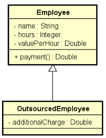
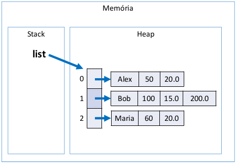

<!-- LOGO DIREITO -->
<a href="#"></a>

# O nível avançado de conhecimento em Programação Orientada a Objetos

<p align="left">
  <a href="https://github.com/JonathanTSilva/HL-Java">
    
  </a>
</p>

🏛 Tudo o que você precisa saber para dominar a Programação Orientada a Objetos (POO).

<!-- SUMÁRIO -->
- [O nível avançado de conhecimento em Programação Orientada a Objetos](#o-nível-avançado-de-conhecimento-em-programação-orientada-a-objetos)
  - [1. Enumeração](#1-enumeração)
    - [1.1. Conversão de `String` para `Enum`](#11-conversão-de-string-para-enum)
    - [1.2. Notação UML](#12-notação-uml)
  - [Bônus: Design do código](#bônus-design-do-código)
    - [Categoria de classes](#categoria-de-classes)
    - [Classe `StringBuilder`](#classe-stringbuilder)
  - [2. Composição](#2-composição)
  - [3. Herança](#3-herança)
    - [3.1. *Upcasting* e *Downcasting*](#31-upcasting-e-downcasting)
    - [3.2. Sobreposição ou sobrescrita](#32-sobreposição-ou-sobrescrita)
    - [3.3. Palavra `super`](#33-palavra-super)
    - [3.4. Palavra `final`](#34-palavra-final)
  - [5. Polimorfismo](#5-polimorfismo)
  - [6. Classes e métodos abstratos](#6-classes-e-métodos-abstratos)

<!-- VOLTAR AO INÍCIO -->
<a href="#"></a>

## 1. Enumeração

Uma enumeração é um tipo especial que serve para especificar de forma literal um conjunto de constantes relacionadas. A palavra chave da enumeração em Java é `enum`

Possui como vantagem uma melhor semântica e um código mais legível e auxiliado pelo compilador

Para referência, verificar o tutorial de [Enum Types][1] e documentação da classe [Enum][2].

**Exemplo:** ciclo de vida de um pedido.

![cicloPedido][A]

```java
package entities.enums;

public enum OrderStatus {
    PENDING_PAYMENT,
    PROCESSING,
    SHIPPED,
    DELIVERED;
}
```

```java
package entities;

import java.util.Date;
import entities.enums.OrderStatus;

public class Order {
    private Integer id;
    private Date moment;
    private OrderStatus status;
    (...)
}
```

### 1.1. Conversão de `String` para `Enum`

Essa conversão é importante, pois a aplicação que utiliza o `Enum` pede que o usuário entre com algum valor para ele, e fatalmente o usuário entra com esse valor na forma de `String`. Assim, essa string é convertida para uma instância do tipo `Enum`.

```java
OrderStatus os1 = OrderStatus.DELIVERED;
OrderStatus os2 = OrderStatus.valueOf("DELIVERED");
```

### 1.2. Notação UML

A notação UML para o tipo `Enum` é dada em dois tipos, conforme imagem abaixo:

![notUMLEnum][B]

## Bônus: Design do código

### Categoria de classes

Em um sistema orientado a objetos, de modo geral, "tudo" é objeto.

Por questões de design tais como organização, flexibilidade, reutilização, delegação, etc., há várias categorias de classes:

- Views - telas do sistema;
- Controllers - o elemento que intermedeia as telas e o sistema;
- Entities - entidades de negócios, como: produtos, clientes, pedidos, etc.;
- Services - elementos que executa ações, como: enviar emails, autenticação, etc.;
- Repositories - objetos responsáveis por acessar os dados do banco de dados;
- Entre outros.

**Exemplo de *Entities***

![entitiesEx][C]

**Exemplo de *Services***

![servicesEx][D]

### Classe `StringBuilder`

A classe `StringBuilder` faz parte do pacote `java.lang`. Essa classe permite criar e manipular dados de Strings dinamicamente, ou seja, podem criar variáveis de String modificáveis.

**Características da classe:**

- Armazena caracteres especificados pela sua capacidade, caso ela seja excedida, é aumentada para acomodar os caracteres adicionais;
- Não precisa alocar novos objetos quando realiza uma concatenação;
- Não são sincronizadas;
- Não são seguras para threads.

Uma vantagem sobre a classe String é a concatenação de strings. Pois quando concatena strings com StringBuilder é invocado o método append. Esse método aloca novas strings concatenadas para o mesmo objeto, ou seja, cada vez que concatena strings não são criadas cópias dos objetos como é realizado pelo método `concat` da classe String, contribuindo para um melhor desempenho do sistema.

```java
// Aqui que entra a importância da classe StringBuilder.
// Se for montar o toString com vários comentários e informações 
// apenas com concatenações, será utilizada muita memória
public String toString() {
  StringBuilder sb = new StringBuilder();
  sb.append(title + "\n");
  sb.append(likes);
  sb.append(" Likes - ");
  sb.append(sdf.format(moment) + "\n");
  sb.append(content + "\n");
  sb.append("Comments:\n");
  for (Comment c : comments) {
    sb.append(c.getText() + "\n");
  }
  return sb.toString();
}
```

<!-- VOLTAR AO INÍCIO -->
<a href="#"></a>

## 2. Composição

Composição é um tipo de associação que permite que um objeto contenha outro. Possui um relação de "tem-um" ou "tem-vários".

Apresenta as principais vantagens:

- Organização: divisão de responsabilidades;
- Coesão: cada objeto é responsável por uma única coisa; simples e bem definida;
- Flexibilidade: trabalhar com uma coisa que está divida em parte é mais flexível;
- Reuso: o mesmo objeto pode ser utilizado em vários lugares.

> **Nota:** embora o símbolo UML para composição (todo-parte) seja o **diamante preto**, neste contexto estamos chamando de composição qualquer associação tipo "tem-um" e "tem-vários".

Como exemplo, ver exemplo de UML de Entities na subseção [Categoria de classes](#categoria-de-classes), na qual diz que um pedido tem vários itens. A seta partindo de **Order** e chegando em **OrderItem** indica composição: uma ordem contêm vários itens (símbolo de composição é o diamante preto, sendo que o lado do diamante é o lado do todo e o outro, o lado das partes). Se observar a de baixo, mesmo que não tenha o diamante preto sinalizando a relação todo parte (um pedido tem um cliente), chama-se de composição de objetos, pois quando for criado o objeto pedido, haverá um atributo do tipo cliente.

A composição de objeto pode ocorrer não apenas com entidades, mas também como serviços (vide segunda imagem de Services da subseção [Categoria de classes](#categoria-de-classes)).

**Exercício resolvido:** ler os dados de um trabalhador com N contratos (N fornecido pelo usuário). Depois, solicitar do usuário um mês e mostrar qual foi o salário do funcionário nesse mês, conforme exemplo.

<details close="close" align="left">
  <summary><b>Diagrama UML</b></summary>
  <p float="left">
    
  </p>
</details>

<details close="close" align="left">
  <summary><b>Exemplo</b></summary>
  <pre>
    <code>
Enter department's name: Design
Enter worker data:
Name: Alex
Level: MID_LEVEL
Base salary: 1200.00
How many contracts to this worker? 3
Enter contract #1 data:
Date (DD/MM/YYYY): 20/08/2018
Value per hour: 50.00
Duration (hours): 20
Enter contract #2 data:
Date (DD/MM/YYYY): 13/06/2018
Value per hour: 30.00
Duration (hours): 18
Enter contract #3 data:
Date (DD/MM/YYYY): 25/08/2018
Value per hour: 80.00
Duration (hours): 10
<br>
Enter month and year to calculate income (MM/YYYY): 08/2018
Name: Alex
Department: Design
Income for 08/2018: 3000.00
    </code>
  </pre>
</details>

<details close="close" align="left">
  <summary><b>Diagrama de objetos: objetos em memória</b></summary>
  <p float="left">
    
  </p>
</details>

**src > application > Program.java**

```java
package application;

import java.text.ParseException;
import java.text.SimpleDateFormat;
import java.util.Date;
import java.util.Locale;
import java.util.Scanner;

import entities.Department;
import entities.HourContract;
import entities.Worker;
import entities.enums.WorkerLevel;


public class Program {

  public static void main(String[] args) throws ParseException {
    
    Locale.setDefault(Locale.US);
    Scanner sc = new Scanner(System.in);
    SimpleDateFormat sdf = new SimpleDateFormat("dd/MM/yyyy");
    
    System.out.print("Enter department's name: ");
    String departmentName = sc.nextLine();
    System.out.println("Enter worker data:");
    System.out.print("Name: ");
    String workerName = sc.nextLine();
    System.out.print("Level: ");
    String workerLevel = sc.nextLine();
    System.out.print("Base salary: ");
    double baseSalary = sc.nextDouble();
    Worker worker = new Worker(workerName, WorkerLevel.valueOf(workerLevel), baseSalary, new Department(departmentName));
    
    System.out.print("How many contracts to this worker? ");
    int n = sc.nextInt();
    
    for (int i = 1; i <= n; i++) {
      System.out.println("Enter contract #" + i + " data:");
      System.out.print("Date (DD/MM/YYYY): ");
      Date contractDate = sdf.parse(sc.next());
      System.out.print("Value per hour: ");
      double valuePerHour = sc.nextDouble();
      System.out.print("Duration (hours): ");
      int hours = sc.nextInt();
      HourContract contract = new HourContract(contractDate, valuePerHour, hours);
      worker.addContract(contract);
    }
    
    System.out.println();
    System.out.print("Enter month and year to calculate income (MM/YYYY): ");
    String monthAndYear = sc.next();
    int month = Integer.parseInt(monthAndYear.substring(0, 2)); // Recorta a posição 0 e 1
    int year = Integer.parseInt(monthAndYear.substring(3)); // Recorta da posição 3 em diante
    System.out.println("Name: " + worker.getName());
    System.out.println("Department: " + worker.getDepartment().getName()); // Composição de objetos
    System.out.println("Income for " + monthAndYear + ": " + String.format("%.2f", worker.income(year, month)));
    
    sc.close();

  }

}
```

**src > entities > Department.java**

```java
package entities;

public class Department {
  
  private String name;

  public Department() {
  }

  public Department(String name) {
    this.name = name;
  }

  public String getName() {
    return name;
  }

  public void setName(String name) {
    this.name = name;
  }

}
```

**src > entities > HourContract.java**

```java
package entities;

import java.util.Date;

public class HourContract {

  private Date date;
  private Double valuePerHour;
  private Integer hours;
  
  public HourContract() {
  }

  public HourContract(Date date, Double valuePerHour, Integer hours) {
    this.date = date;
    this.valuePerHour = valuePerHour;
    this.hours = hours;
  }

  public Date getDate() {
    return date;
  }

  public void setDate(Date date) {
    this.date = date;
  }

  public Double getValuePerHour() {
    return valuePerHour;
  }

  public void setValuePerHour(Double valuePerHour) {
    this.valuePerHour = valuePerHour;
  }

  public Integer getHours() {
    return hours;
  }

  public void setHours(Integer hours) {
    this.hours = hours;
  }
  
  public double totalValue() {
    return valuePerHour * hours;
  }
  
}
```

**src > entities > Worker.java**

```java
package entities;

import java.util.ArrayList;
import java.util.Calendar;
import java.util.List;

import entities.enums.WorkerLevel;

public class Worker {

  private String name;
  private WorkerLevel level;
  private Double baseSalary;
  
  // Associações
  private Department department;
  private List<HourContract> contracts = new ArrayList<>(); // Como um Worker tem vários contratos (1,*), é representado com uma lista
  // IMPORTANTE! Quando se tem uma composição tem muitos, a lista não é incluída no construtor, mas simplesmente iniciada vazia aqui.
  
  public Worker() {
  }

  public Worker(String name, WorkerLevel level, Double baseSalary, Department department) {
    this.name = name;
    this.level = level;
    this.baseSalary = baseSalary;
    this.department = department;
  }

  public String getName() {
    return name;
  }

  public void setName(String name) {
    this.name = name;
  }

  public WorkerLevel getLevel() {
    return level;
  }

  public void setLevel(WorkerLevel level) {
    this.level = level;
  }

  public Double getBaseSalary() {
    return baseSalary;
  }

  public void setBaseSalary(Double baseSalary) {
    this.baseSalary = baseSalary;
  }

  public Department getDepartment() {
    return department;
  }

  public void setDepartment(Department department) {
    this.department = department;
  }

  public List<HourContract> getContracts() {
    return contracts;
  }
  
  // Têm-se estes dois métodos para fazer ou desfazer a associação entre um trabalhador e um contrato. Add ou remove da lista.
  // Assim, é preciso remover o setContracts do Setters, pois de maneira alguma, eu posso trocar essa lista de contratos por outra nova.
  public void addContract(HourContract contract) {
    contracts.add(contract);
  }
  
  public void removeContract(HourContract contract) {
    contracts.remove(contract);
  }
  
  public double income(int year, int month) {
    double sum = baseSalary;
    
    Calendar cal = Calendar.getInstance();
    
    // Percorre por todos os contratos da lista, testando se o contrato é desse mês e ano passado.
    // Se sim, ele entra na soma do salário.
    for (HourContract c : contracts) {
      // Se fosse a soma de todos os contratos, seria sum += c.totalValue();
      // Entretanto, queremos a soma desse mes e ano
      cal.setTime(c.getDate()); // Pega a data do contrato e define ela como sendo a data do calendário
      int c_year = cal.get(Calendar.YEAR);
      int c_month = 1 + cal.get(Calendar.MONTH);
      if (year == c_year && month == c_month) {
        sum += c.totalValue();
      }
    }
    return sum;
  }
  
}
```

**src > entities.enums > WorkerLevel.java**

```java
package entities.enums;

public enum WorkerLevel {
  
  JUNIOR,
  MID_LEVEL,
  SENIOR;
  
}
```

<!-- VOLTAR AO INÍCIO -->
<a href="#"></a>

## 3. Herança

Herança é um tipo de associação que permite que uma classe herde todos dados e comportamentos de outra.

Apresenta como principais vantagens o **reuso** e o **polimorfismo** e tem a sintaxe: `class A extends B`;

**Exemplo:** suponha um negócio de banco que possui uma conta comum e uma conta para empresas, sendo que a conta para empresa possui todos membros da conta comum, mais um limite de empréstimo e uma operação de realizar empréstimo.

![heranca][E]

Neste caso, a herança permite a reutilização das variáveis e métodos de uma classe na outra:

![heranca2][F]

**src > entities > Account.java**

```java
package entities;

public class Account {

  private Integer number;
  private String holder;
  protected Double balance;

  public Account() {
  }

  public Account(Integer number, String holder, Double balance) {
    this.number = number;
    this.holder = holder;
    this.balance = balance;
  }

  public Integer getNumber() {
    return number;
  }
[F]: ../../Images/herancaEx2.png
  public void setNumber(Integer number) {
    this.number = number;
  }

  public String getHolder() {
    return holder;
  }

  public void setHolder(String holder) {
    this.holder = holder;
  }

  public Double getBalance() {
    return balance;
  }

  public void withdraw(double amount) {
    balance -= amount;
  }

  public void deposit(double amount) {
    balance += amount;
  }
}
```

**src > entities > BusinessAccount.java**

```java
package entities;

public class BusinessAccount extends Account {

  private Double loanLimit; // limite de empréstimo

  public BusinessAccount() {
    super();
  }

  public BusinessAccount(Integer number, String holder, Double balance, Double loanlimit) {
    super(number, holder, balance); // Construtor da super classe (Account);
    this.loanLimit = loanlimit;
  }

  public Double getLoanlimit() {
    return loanLimit;
  }

  public void setLoanlimit(Double loanlimit) {
    this.loanLimit = loanlimit;
  }

  public void loan(double amount) {
    if (amount <= loanLimit) {
      balance += amount - 10.0; // Neste caso, se o atributo balance estivesse como private, não conseguiria enxergá-lo
    }
  }
}
```

Percebe-se a utilização do modificador de acesso `Protected`. Verificar capítulo 9 do artigo [Introdução à Programação Orientada a Objetos][3].

Alguns pontos são importantes enfatizar para herança:

- Relação "é-um": a conta empresarial é uma conta, com algumas coisas a mais;
- Generalização / especialização: a classe Account é chamada de generalização e a BusinessAccount, especialização;
- Superclasse (classe base) / subclasse (classe derivada);
- Herança / extensão;
- Herança é uma associação entre classes (e não entre objetos);

<!-- VOLTAR AO INÍCIO -->
<a href="#"></a>

### 3.1. *Upcasting* e *Downcasting*

- Upcasting:
  - Casting da subclasse para superclasse
  - Uso comum: `polimorfismo`
- Downcasting:
  - Casting da superclasse para subclasse
  - Palavra `instanceof`
  - Uso comum: métodos que recebem parâmetros genéricos (ex: `Equals`)

Exemplo:

![casting][G]

```java
package application;

import entities.Account;
import entities.BusinessAccount;
import entities.SavingsAccount;

public class Program {

  public static void main(String[] args) {
    
    Account acc = new Account(1001, "Alex", 0.0);
    BusinessAccount bacc = new BusinessAccount(1002, "Maria", 0.0, 500.0);
    
    // UPCASTING - pegar um objeto do tipo bacc e atribuí-lo para uma variável do tipo acc
    Account acc1 = bacc; // A herança é uma relação "É um". bacc é um acc;
    Account acc2 = new BusinessAccount(1003, "Bob", 0.0, 200.0);
    Account acc3 = new SavingsAccount(1004, "Anna", 0.0, 0.01); // Pegar objeto de subclasse e atribui-lo para var da super
        
    // DOWNCASTING - 
    //BusinessAccount bacc2 = acc2; // Erro = incompatibilidade de tipos
    // Mesmo tendo instanciado ela como BusinessAccount, essa variável acc2 é do tipo Account. A conversão não é natural.
    // Para contornar esse problema, fazer um casting manual
    BusinessAccount bacc3 = (BusinessAccount)acc2;
    bacc3.loan(100.0);
    
    // Erro em tempo de execução:
    // BusinessAccount bacc4 = (BusinessAccount)acc3; // acc3 foi instanciada como SavingsAccount = é Account mas não BusinessAccount
    // Na hora de fazer o downcasting, nem sempre dá certo e o computador não sabe disso. Vai do programador
    
    // INSTANCEOF
    if (acc3 instanceof BusinessAccount) {
      BusinessAccount bacc5 = (BusinessAccount)acc3;
      bacc5.loan(200.0);
      System.out.println("Loan!");
    }
    
    if (acc3 instanceof SavingsAccount) {
      SavingsAccount bacc5 = (SavingsAccount)acc3;
      bacc5.updateBalance();
      System.out.println("Update!");
    }
  }
}
```

**src > entities > SavingsAccount.java**

```java
package entities;

public class SavingsAccount extends Account {

  private Double interestRate;

  public SavingsAccount() {
    super();
  }

  public SavingsAccount(Integer number, String holder, Double balance, Double interestRate) {
    super(number, holder, balance);
    this.interestRate = interestRate;
  }

  public Double getInterestRate() {
    return interestRate;
  }

  public void setInterestRate(Double interestRate) {
    this.interestRate = interestRate;
  }

  public void updateBalance() {
    balance += balance * interestRate;
  }
}
```

### 3.2. Sobreposição ou sobrescrita

É a implementação de um método de uma super classe na subclasse.

É fortemente recomendado utilizar a anotação `@Override` em um método sobrescrito, pois isso facilita a leitura e compreensão do código, e também é avisado ao compilador (boa prática).

**Exemplo:** suponha que a operação de saque possui uma taxa no valo de 5.0. Entretanto, se a conta for do tipo poupança, esta taxa não deve ser cobrada. Como resolver isso?

![override][H]

Resposta: sobrescrevendo o método withdraw na subclasse SavingsAccount

**src > entities > Account.java**

```java
public void withdraw(double amount) {
  balance -= amount + 5.0
}
```

**src > entities > SavingsAccount.java**

```java
@Override
public void withdraw(double amount) {
  balance -= amount
}
```

O `@Override` pode ser apagado e o código debuggado sem problema. Entretanto, caso seja digitado o nome do método errado, por exemplo, seria executado como um método único da SavingsAccount. Assim, o `@Override` evita tais erros, pois busca em superclasses os métodos ou atributos que serão sobrepostos.

**src > application > Program.java**
```java
Account acc1 = new Account(1001, "Alex", 1000.0);
acc1.withdraw(200.0);
System.out.println(acc1.getBalance());

Account acc2 = new SavingsAccount(1002, "Maria", 1000.0, 0.01);
acc2.withdraw(200.0);
System.out.println(acc3.getBalance());
```

### 3.3. Palavra `super`

É possível chamar a implementação da superclasse usando a palavra `super`.

**Exemplo:** suponha que, na classe BusinessAccount, a regra para saque seja realizar o saque normalmente da superclasse, e descontar mais 2.0.

```java
@Override
public void withdraw(double amount) {
  super.withdraw(amount);
  balance -= 2.0;
}
```

> **Nota:** o `super` também é utilizado em construtores:

### 3.4. Palavra `final`

A palavra chave final, quando utilizado em **classes**, evita que a mesma seja herdada:

```java
public final class SavingsAccount {}
```

Já quando utilizada em **métodos**, evita que o método seja sobreposto.

```java
@Override
public final void withdraw(double amount) {...}
```

![final][I]

**Pra quê utilizar a palavra `final`?**

- Segurança: dependendo das regras do negócio, às vezes é desejável garantir que uma classe não seja herdada, ou que um método não seja sobreposto.
  - Geralmente convém acrescentar `final` em métodos sobrepostos, pois sobreposições múltiplas podem ser uma porta de entrada para **inconsistências**.
- Performance: atributos de tipo de uma classe `final` são analisados de forma mais rápida em tempo de execução.
  - Exemplo clássico: `String`.

<!-- VOLTAR AO INÍCIO -->
<a href="#"></a>

## 5. Polimorfismo

Para relembrar, os pilares da Programação Orientada a Objetos são:

- Encapsulamento;
- Herança;
- Polimorfismo.

Em Programação Orientada a Objetos, polimorfismo é recurso que permite que **variáveis de um mesmo tip**o mais genérico possam apontar para **objetos de tipos específicos diferentes**, tendo assim **comportamentos diferentes conforme cada tipo específico**.

![poli][J]

> **Nota:** o conceito de polimorfismo é simples, mas as aplicações fornecem uma gama infinita de possibilidades, permitindo soluções sofisticadas, elegantes e flexíveis.

É importante entendermos que a associação do tipo específico com o tipo genérico é feita em tempo de execução (upcasting).

O compilador não sabe para qual tipo específico a chamada do método Withdraw está sendo feita (ele só sabe que são duas variáveis tipo Account).

**Exemplo resolvido:** Uma empresa possui funcionários próprios e terceirizados. Para cada funcionário, deseja-se registrar nome, horas trabalhadas e valor por hora. Funcionários terceirizado possuem ainda uma despesa adicional. 

O pagamento dos funcionários corresponde ao valor da hora multiplicado pelas horas trabalhadas, sendo que os funcionários terceirizados ainda recebem um bônus correspondente a 110% de sua despesa adicional. 

Fazer um programa para ler os dados de N funcionários (N fornecido pelo usuário) e armazená-los em uma lista. Depois de ler todos os dados, mostrar nome e pagamento de cada funcionário na mesma ordem em que foram digitados. 

Construa o programa conforme projeto abaixo:

<details close="close" align="left">
  <summary><b>Diagrama UML</b></summary>
  <p float="left">
    
  </p>
</details>

<details close="close" align="left">
  <summary><b>Exemplo</b></summary>
  <pre>
    <code>
Enter the number of employees: 3
Employee #1 data:
Outsourced (y/n)? n
Name: Alex
Hours: 50
Value per hour: 20.00
Employee #2 data:
Outsourced (y/n)? y
Name: Bob
Hours: 100
Value per hour: 15.00
Additional charge: 200.00
Employee #3 data:
Outsourced (y/n)? n
Name: Maria
Hours: 60
Value per hour: 20.00
<br>
PAYMENTS:
Alex - $ 1000.00
Bob - $ 1720.00
Maria - $ 1200.00
    </code>
  </pre>
</details>

<details close="close" align="left">
  <summary><b>Diagrama de objetos: objetos em memória</b></summary>
  <p float="left">
    
  </p>
</details>

**src > application > Program.java**

```java
package application;

import java.util.ArrayList;
import java.util.List;
import java.util.Locale;
import java.util.Scanner;

import entities.Employee;
import entities.OutsourcedEmployee;

public class Program {
  public static void main(String[] args) {
    Locale.setDefault(Locale.US);
    Scanner sc = new Scanner(System.in);
    
    List<Employee> list = new ArrayList<>();
    
    System.out.print("Enter the number of employees: ");
    int n = sc.nextInt();
    
    for (int i = 1; i <= n; i++) {
      System.out.println("Employee #" + i + " data:");
      System.out.print("Outsourced (y/n)? ");
      char ch = sc.next().charAt(0);
      System.out.print("Name: ");
      sc.nextLine();
      String name = sc.nextLine();
      System.out.print("Hours: ");
      int hours = sc.nextInt();
      System.out.print("Value per hour: ");
      double valuePerHour = sc.nextDouble();
      
      if (ch == 'y') {
        System.out.print("Additional charge: ");
        double additionalCharge = sc.nextDouble();
        Employee emp = new OutsourcedEmployee(name, hours, valuePerHour, additionalCharge);
        list.add(emp);
      } else {
        Employee emp = new Employee(name, hours, valuePerHour);
        list.add(emp);
      }
    }
    
    System.out.println();
    System.out.println("PAYEMENTS:");
    
    for (Employee emp : list) {
      System.out.println(emp.getName() + " - $ " + String.format("%.2f", emp.payment()));
    }
    
    sc.close();
  }
}
```

**src > entities > Employee.java**

```java
package entities;

public class Employee {

  private String name;
  private Integer hours;
  private Double valuePerHour;
  
  public Employee() {
  }

  public Employee(String name, Integer hours, Double valuePerHour) {
    this.name = name;
    this.hours = hours;
    this.valuePerHour = valuePerHour;
  }

  public String getName() {
    return name;
  }

  public void setName(String name) {
    this.name = name;
  }

  public Integer getHours() {
    return hours;
  }

  public void setHours(Integer hours) {
    this.hours = hours;
  }

  public Double getValuePerHour() {
    return valuePerHour;
  }

  public void setValuePerHour(Double valuePerHour) {
    this.valuePerHour = valuePerHour;
  }
  
  public double payment() {
    return hours * valuePerHour;
  }

}
```

**src > entities > OutsourcedEmployee.java**

```java
package entities;

public class OutsourcedEmployee extends Employee {

  private Double additionalCharge;

  public OutsourcedEmployee() {
    super();
  }
  
  public OutsourcedEmployee(String name, Integer hours, Double valuePerHour, Double additionalCharge) {
    super(name, hours, valuePerHour);
    this.additionalCharge = additionalCharge;
  }

  public Double getAdditionalCharge() {
    return additionalCharge;
  }

  public void setAdditionalCharge(Double additionalCharge) {
    this.additionalCharge = additionalCharge;
  }
  
  @Override
  public double payment() {
    return super.payment() + additionalCharge * 1.1;
  }

}
```

<!-- VOLTAR AO INÍCIO -->
<a href="#"></a>

## 6. Classes e métodos abstratos

São classes abstratas aquelas que não podem ser instanciadas. É uma forma de garantir herança total: somente subclasses não abstratas podem ser instanciadas, mas nunca a superclasse abstrata.

**Exemplo:** Suponha que em um negócio relacionado a banco, apenas contas poupança e contas para empresas são permitidas. Não existe conta comum. Para garantir que contas comuns não possam ser instanciadas, basta acrescentarmos a palavra "abstract" na declaração da classe.

```java
public abstract class Account {
  ...
}
```

A notação UML para classes abstratas é o nome da classe em *itálico*.

Para o Program.java do exemplo acima, não se pode instanciar uma classe `Account` com o tipo `Account`, pois ela é uma classe abstrata.

```java
public class Program {
  public static void main(String[] args) {
    Account acc1 = new Account(1001, "Alex", 1000.0); // Erro
    Account acc2 = new SavingsAccount(1002, "Maria", 1000.0, 0.01);
    Account acc3 = new BusinessAccount(1003, "Bob", 1000.0, 500.0);
  }
}
```

**Questionamento:** se a classe Account não pode ser instanciada, por que simplesmente não criar somente SavingsAccount e BusinessAccount?

R.: Por conta da *reutilização* e do *polimorfismo*: a superclasse genérica nos permite tratar de forma fácil e uniforme todos os tipos de conta, inclusive com polimorfismo se for o caso (como foi feito nos últimos exercícios). Por exemplo, é possível colocar todos os tipos de contas em uma mesma coleção.

Assim, suponha que seja preciso totalizar o saldo de todas as contas ou depositar R$ 10.00 em todas as contas:

```java
public class Program {
  public static void main(String[] args) {
    
    Locale.setDefault(Locale.US);
    List<Account> list = new ArrayList<>();

    list.add(new SavingsAccount(1001, "Alex", 500.0, 0.01));
    list.add(new BusinessAccount(1002, "Maria", 1000.0, 400.0));
    list.add(new SavingsAccount(1003, "Bob", 300.0, 0.01));
    list.add(new BusinessAccount(1004, "Ana", 400.0, 500.0));

    double sum = 0.0;
    for (Account acc : list) {
      sum += acc.getBalance();
    }

    System.out.printf("Total balance: %.2f%n", sum);

    for (Account acc : list) {
      acc.deposit(10.0);
    }

    for (Account acc : list) {
      System.out.printf("Updated balance for account %d: %.2f%n", acc.getNumber(), acc.getBalance());
    }
  }
}
```

Métodos abstratos são métodos que não possuem implementação. Eles precisam ser abstratos quando a classe é genérica demais para conter sua implementação.

Se um classe possuir pelo menos um método abstrato, então esta classe também é abstrata.

A notação UML para os métodos abstratos também é o *itálico*.

![exMetAbs][K]

**Questionamento:** par ao exemplo acima, quanto vale a *`+area()`* de uma *Shape*, sem especificar qual forma é?

R.: Não tem como, pois a classe genérica é demais; por isso deve-se deixar o método abstrato para implementá-lo apenas pelas subclasses.

> **Nota:** a classe Shape também é abstrata, uma vez que ela possui um método abstrato.

**Exercício resolvido:** fazer um programa para ler os dados de N figuras (N fornecido pelo usuário), e depois mostrar as áreas destas figuras na mesma ordem em que foram digitadas.

<details close="close" align="left">
  <summary><b>Exemplo</b></summary>
  <pre>
    <code>
Enter the number of shapes: 2
Shape #1 data:
Rectangle or Circle (r/c)? r
Color (BLACK/BLUE/RED): BLACK
Width: 4.0
Height: 5.0
Shape #2 data:
Rectangle or Circle (r/c)? c
Color (BLACK/BLUE/RED): RED
Radius: 3.0
<br>
SHAPE AREAS:
20.00
28.27
    </code>
  </pre>
</details>

**src > application > Program.java**

```java
package application;

import java.util.ArrayList;
import java.util.Iterator;
import java.util.List;
import java.util.Locale;
import java.util.Scanner;

import entities.Circle;
import entities.Rectangle;
import entities.Shape;
import entities.enums.Color;

public class Program {

  public static void main(String[] args) {
      
    Locale.setDefault(Locale.US);
    Scanner sc = new Scanner(System.in);
    
    // Sempre utilize a lista do tipo genérico, pois está querendo polimorfismo. Dessa forma, ela aceita dados de todos os tipos de subclasses
    List<Shape> list = new ArrayList<>();

    System.out.print("Enter the number of shapes: ");
    int n = sc.nextInt();
    
    for (int i = 1; i<=n; i++) {
      System.out.println("Shape #" + i + " data:");
      System.out.print("Rectangle or Circle (r/c)? ");
      char ch = sc.next().charAt(0);
      System.out.print("Color (BLACK/BLUE/RED): ");
      Color color = Color.valueOf(sc.next());
      
      if (ch == 'r') {
        System.out.print("Width: ");
        double width = sc.nextDouble();
        System.out.print("Height: ");
        double height = sc.nextDouble();
        list.add(new Rectangle(color, width, height));
      } else {
        System.out.print("Radius: ");
        double radius = sc.nextDouble();
        list.add(new Circle(color, radius));
      }
    }
    
    System.out.println();
    System.out.println("SHAPE AREAS:");
    
    for (Shape shape : list) {
      System.out.println(String.format("%.2f", shape.area()));
    }
    
    sc.close();
      
  }

}

```

**src > entities > Shape.java**

```java
package entities;

import entities.enums.Color;

public abstract class Shape {
    
  private Color color;
  
  ...

  public void setColor(Color color) {
    this.color = color;
  }
  
  public abstract double area();

}
```

**src > entities > Rectangle.java**

```java
package entities;

import entities.enums.Color;

public class Rectangle extends Shape {

  private Double width;
  private Double height;
  
  ...

  @Override
  public double area() {
    return width * height;
  }

}

```

**src > entities > Circle.java**

```java
package entities;

import entities.enums.Color;

public class Circle extends Shape {

  private Double radius;
  
  ...

  @Override
  public double area() {
    return Math.PI * radius * radius;
  }
}
```

**src > entities.enums > Color.java**

```java
package entities.enums;

public enum Color {

  BLACK,
  BLUE,
  RED;
    
}
```

**Exercício de fixação:** ler os dados de N contribuintes (N fornecido pelo usuário), os quais podem ser pessoa física ou pessoa jurídica, e depois mostrar o valor do imposto pago por cada um, bem como o total de imposto arrecadado. 

Os dados de pessoa física são: nome, renda anual e gastos com saúde. Os dados de pessoa jurídica são nome, renda anual e número de funcionários. As regras para cálculo de imposto são as seguintes: 

Pessoa física: pessoas cuja renda foi abaixo de 20000.00 pagam 15% de imposto. Pessoas com renda de 20000.00 em diante pagam 25% de imposto. Se a pessoa teve gastos com saúde, 50% destes gastos são abatidos no imposto.

- Exemplo: uma pessoa cuja renda foi 50000.00 e teve 2000.00 em gastos com saúde, o imposto fica: (50000 * 25%) - (2000 * 50%) = 11500.00

Pessoa jurídica: pessoas jurídicas pagam 16% de imposto. Porém, se a empresa possuir mais de 10 funcionários, ela paga 14% de imposto.
- Exemplo: uma empresa cuja renda foi 400000.00 e possui 25 funcionários, o imposto fica: 400000 * 14% = 56000.00

<!-- MARKDOWN LINKS -->
<!-- SITES -->
[1]: https://docs.oracle.com/javase/tutorial/java/javaOO/enum.html
[2]: https://docs.oracle.com/en/java/javase/11/docs/api/java.base/java/lang/Enum.html
[3]: introducaoPOO.md

<!-- IMAGES -->
[A]: ../../Images/cicloPedido.png
[B]: ../../Images/umlEnum.png
[C]: ../../Images/entitiesEx.png
[D]: ../../Images/servicesEx.png
[E]: ../../Images/herancaEx.png
[F]: ../../Images/herancaEx2.png
[G]: ../../Images/casting.png
[H]: ../../Images/sobreposicao.png
[I]: ../../Images/final.png
[J]: ../../Images/polimorf.png
[K]: ../../Images/exMetAbs.png