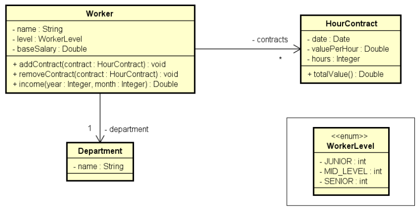

<!-- LOGO DIREITO -->
<a href="#"></a>

# O nível avançado de conhecimento em Programação Orientada a Objetos

<p align="left">
  <a href="https://github.com/JonathanTSilva/HL-Java">
    
  </a>
</p>

🏛 Tudo o que você precisa saber para dominar a Programação Orientada a Objetos (POO).

<!-- SUMÁRIO -->
- [O nível avançado de conhecimento em Programação Orientada a Objetos](#o-nível-avançado-de-conhecimento-em-programação-orientada-a-objetos)
  - [1. Enumeração](#1-enumeração)
    - [1.1. Conversão de `String` para `Enum`](#11-conversão-de-string-para-enum)
    - [1.2. Notação UML](#12-notação-uml)
  - [Bônus: Design do código](#bônus-design-do-código)
    - [Categoria de classes](#categoria-de-classes)
    - [Classe `StringBuilder`](#classe-stringbuilder)
  - [2. Composição](#2-composição)
  - [3. Herança](#3-herança)
  - [4. Polimorfismo](#4-polimorfismo)
  - [5. Tratamento de exceções](#5-tratamento-de-exceções)

<!-- VOLTAR AO INÍCIO -->
<a href="#"></a>

## 1. Enumeração

Uma enumeração é um tipo especial que serve para especificar de forma literal um conjunto de constantes relacionadas. A palavra chave da enumeração em Java é `enum`

Possui como vantagem uma melhor semântica e um código mais legível e auxiliado pelo compilador

Para referência, verificar o tutorial de [Enum Types][1] e documentação da classe [Enum][2].

**Exemplo:** ciclo de vida de um pedido.

![cicloPedido][A]

```java
package entities.enums;

public enum OrderStatus {
    PENDING_PAYMENT,
    PROCESSING,
    SHIPPED,
    DELIVERED;
}
```

```java
package entities;

import java.util.Date;
import entities.enums.OrderStatus;

public class Order {
    private Integer id;
    private Date moment;
    private OrderStatus status;
    (...)
}
```

### 1.1. Conversão de `String` para `Enum`

Essa conversão é importante, pois a aplicação que utiliza o `Enum` pede que o usuário entre com algum valor para ele, e fatalmente o usuário entra com esse valor na forma de `String`. Assim, essa string é convertida para uma instância do tipo `Enum`.

```java
OrderStatus os1 = OrderStatus.DELIVERED;
OrderStatus os2 = OrderStatus.valueOf("DELIVERED");
```

### 1.2. Notação UML

A notação UML para o tipo `Enum` é dada em dois tipos, conforme imagem abaixo:

![notUMLEnum][B]

## Bônus: Design do código

### Categoria de classes

Em um sistema orientado a objetos, de modo geral, "tudo" é objeto.

Por questões de design tais como organização, flexibilidade, reutilização, delegação, etc., há várias categorias de classes:

- Views - telas do sistema;
- Controllers - o elemento que intermedeia as telas e o sistema;
- Entities - entidades de negócios, como: produtos, clientes, pedidos, etc.;
- Services - elementos que executa ações, como: enviar emails, autenticação, etc.;
- Repositories - objetos responsáveis por acessar os dados do banco de dados;
- Entre outros.

**Exemplo de *Entities***

![entitiesEx][C]

**Exemplo de *Services***

![servicesEx][D]

### Classe `StringBuilder`

A classe `StringBuilder` faz parte do pacote `java.lang`. Essa classe permite criar e manipular dados de Strings dinamicamente, ou seja, podem criar variáveis de String modificáveis.

**Características da classe:**

- Armazena caracteres especificados pela sua capacidade, caso ela seja excedida, é aumentada para acomodar os caracteres adicionais;
- Não precisa alocar novos objetos quando realiza uma concatenação;
- Não são sincronizadas;
- Não são seguras para threads.

Uma vantagem sobre a classe String é a concatenação de strings. Pois quando concatena strings com StringBuilder é invocado o método append. Esse método aloca novas strings concatenadas para o mesmo objeto, ou seja, cada vez que concatena strings não são criadas cópias dos objetos como é realizado pelo método `concat` da classe String, contribuindo para um melhor desempenho do sistema.

```java
// Aqui que entra a importância da classe StringBuilder.
// Se for montar o toString com vários comentários e informações 
// apenas com concatenações, será utilizada muita memória
public String toString() {
  StringBuilder sb = new StringBuilder();
  sb.append(title + "\n");
  sb.append(likes);
  sb.append(" Likes - ");
  sb.append(sdf.format(moment) + "\n");
  sb.append(content + "\n");
  sb.append("Comments:\n");
  for (Comment c : comments) {
    sb.append(c.getText() + "\n");
  }
  return sb.toString();
}
```

<!-- VOLTAR AO INÍCIO -->
<a href="#"></a>

## 2. Composição

Composição é um tipo de associação que permite que um objeto contenha outro. Possui um relação de "tem-um" ou "tem-vários".

Apresenta as principais vantagens:

- Organização: divisão de responsabilidades;
- Coesão: cada objeto é responsável por uma única coisa; simples e bem definida;
- Flexibilidade: trabalhar com uma coisa que está divida em parte é mais flexível;
- Reuso: o mesmo objeto pode ser utilizado em vários lugares.

> **Nota:** embora o símbolo UML para composição (todo-parte) seja o **diamante preto**, neste contexto estamos chamando de composição qualquer associação tipo "tem-um" e "tem-vários".

Como exemplo, ver exemplo de UML de Entities na subseção [Categoria de classes](#categoria-de-classes), na qual diz que um pedido tem vários itens. A seta partindo de **Order** e chegando em **OrderItem** indica composição: uma ordem contêm vários itens (símbolo de composição é o diamante preto, sendo que o lado do diamante é o lado do todo e o outro, o lado das partes). Se observar a de baixo, mesmo que não tenha o diamante preto sinalizando a relação todo parte (um pedido tem um cliente), chama-se de composição de objetos, pois quando for criado o objeto pedido, haverá um atributo do tipo cliente.

A composição de objeto pode ocorrer não apenas com entidades, mas também como serviços (vide segunda imagem de Services da subseção [Categoria de classes](#categoria-de-classes)).

**Exercício resolvido:** ler os dados de um trabalhador com N contratos (N fornecido pelo usuário). Depois, solicitar do usuário um mês e mostrar qual foi o salário do funcionário nesse mês, conforme exemplo.

<details close="close" align="left">
  <summary><b>Diagrama UML</b></summary>
  <p float="left">
    
  </p>
</details>

<details close="close" align="left">
  <summary><b>Exemplo</b></summary>
  <pre>
    <code>
Enter department's name: Design
Enter worker data:
Name: Alex
Level: MID_LEVEL
Base salary: 1200.00
How many contracts to this worker? 3
Enter contract #1 data:
Date (DD/MM/YYYY): 20/08/2018
Value per hour: 50.00
Duration (hours): 20
Enter contract #2 data:
Date (DD/MM/YYYY): 13/06/2018
Value per hour: 30.00
Duration (hours): 18
Enter contract #3 data:
Date (DD/MM/YYYY): 25/08/2018
Value per hour: 80.00
Duration (hours): 10
<br>
Enter month and year to calculate income (MM/YYYY): 08/2018
Name: Alex
Department: Design
Income for 08/2018: 3000.00
    </code>
  </pre>
</details>

<details close="close" align="left">
  <summary><b>Diagrama de objetos: objetos em memória</b></summary>
  <p float="left">
    
  </p>
</details>

**src > application > Program.java**

```java
package application;

import java.text.ParseException;
import java.text.SimpleDateFormat;
import java.util.Date;
import java.util.Locale;
import java.util.Scanner;

import entities.Department;
import entities.HourContract;
import entities.Worker;
import entities.enums.WorkerLevel;


public class Program {

  public static void main(String[] args) throws ParseException {
    
    Locale.setDefault(Locale.US);
    Scanner sc = new Scanner(System.in);
    SimpleDateFormat sdf = new SimpleDateFormat("dd/MM/yyyy");
    
    System.out.print("Enter department's name: ");
    String departmentName = sc.nextLine();
    System.out.println("Enter worker data:");
    System.out.print("Name: ");
    String workerName = sc.nextLine();
    System.out.print("Level: ");
    String workerLevel = sc.nextLine();
    System.out.print("Base salary: ");
    double baseSalary = sc.nextDouble();
    Worker worker = new Worker(workerName, WorkerLevel.valueOf(workerLevel), baseSalary, new Department(departmentName));
    
    System.out.print("How many contracts to this worker? ");
    int n = sc.nextInt();
    
    for (int i = 1; i <= n; i++) {
      System.out.println("Enter contract #" + i + " data:");
      System.out.print("Date (DD/MM/YYYY): ");
      Date contractDate = sdf.parse(sc.next());
      System.out.print("Value per hour: ");
      double valuePerHour = sc.nextDouble();
      System.out.print("Duration (hours): ");
      int hours = sc.nextInt();
      HourContract contract = new HourContract(contractDate, valuePerHour, hours);
      worker.addContract(contract);
    }
    
    System.out.println();
    System.out.print("Enter month and year to calculate income (MM/YYYY): ");
    String monthAndYear = sc.next();
    int month = Integer.parseInt(monthAndYear.substring(0, 2)); // Recorta a posição 0 e 1
    int year = Integer.parseInt(monthAndYear.substring(3)); // Recorta da posição 3 em diante
    System.out.println("Name: " + worker.getName());
    System.out.println("Department: " + worker.getDepartment().getName()); // Composição de objetos
    System.out.println("Income for " + monthAndYear + ": " + String.format("%.2f", worker.income(year, month)));
    
    sc.close();

  }

}
```

**src > entities > Department.java**

```java
package entities;

public class Department {
  
  private String name;

  public Department() {
  }

  public Department(String name) {
    this.name = name;
  }

  public String getName() {
    return name;
  }

  public void setName(String name) {
    this.name = name;
  }

}
```

**src > entities > HourContract.java**

```java
package entities;

import java.util.Date;

public class HourContract {

  private Date date;
  private Double valuePerHour;
  private Integer hours;
  
  public HourContract() {
  }

  public HourContract(Date date, Double valuePerHour, Integer hours) {
    this.date = date;
    this.valuePerHour = valuePerHour;
    this.hours = hours;
  }

  public Date getDate() {
    return date;
  }

  public void setDate(Date date) {
    this.date = date;
  }

  public Double getValuePerHour() {
    return valuePerHour;
  }

  public void setValuePerHour(Double valuePerHour) {
    this.valuePerHour = valuePerHour;
  }

  public Integer getHours() {
    return hours;
  }

  public void setHours(Integer hours) {
    this.hours = hours;
  }
  
  public double totalValue() {
    return valuePerHour * hours;
  }
  
}
```

**src > entities > Worker.java**

```java
package entities;

import java.util.ArrayList;
import java.util.Calendar;
import java.util.List;

import entities.enums.WorkerLevel;

public class Worker {

  private String name;
  private WorkerLevel level;
  private Double baseSalary;
  
  // Associações
  private Department department;
  private List<HourContract> contracts = new ArrayList<>(); // Como um Worker tem vários contratos (1,*), é representado com uma lista
  // IMPORTANTE! Quando se tem uma composição tem muitos, a lista não é incluída no construtor, mas simplesmente iniciada vazia aqui.
  
  public Worker() {
  }

  public Worker(String name, WorkerLevel level, Double baseSalary, Department department) {
    this.name = name;
    this.level = level;
    this.baseSalary = baseSalary;
    this.department = department;
  }

  public String getName() {
    return name;
  }

  public void setName(String name) {
    this.name = name;
  }

  public WorkerLevel getLevel() {
    return level;
  }

  public void setLevel(WorkerLevel level) {
    this.level = level;
  }

  public Double getBaseSalary() {
    return baseSalary;
  }

  public void setBaseSalary(Double baseSalary) {
    this.baseSalary = baseSalary;
  }

  public Department getDepartment() {
    return department;
  }

  public void setDepartment(Department department) {
    this.department = department;
  }

  public List<HourContract> getContracts() {
    return contracts;
  }
  
  // Têm-se estes dois métodos para fazer ou desfazer a associação entre um trabalhador e um contrato. Add ou remove da lista.
  // Assim, é preciso remover o setContracts do Setters, pois de maneira alguma, eu posso trocar essa lista de contratos por outra nova.
  public void addContract(HourContract contract) {
    contracts.add(contract);
  }
  
  public void removeContract(HourContract contract) {
    contracts.remove(contract);
  }
  
  public double income(int year, int month) {
    double sum = baseSalary;
    
    Calendar cal = Calendar.getInstance();
    
    // Percorre por todos os contratos da lista, testando se o contrato é desse mês e ano passado.
    // Se sim, ele entra na soma do salário.
    for (HourContract c : contracts) {
      // Se fosse a soma de todos os contratos, seria sum += c.totalValue();
      // Entretanto, queremos a soma desse mes e ano
      cal.setTime(c.getDate()); // Pega a data do contrato e define ela como sendo a data do calendário
      int c_year = cal.get(Calendar.YEAR);
      int c_month = 1 + cal.get(Calendar.MONTH);
      if (year == c_year && month == c_month) {
        sum += c.totalValue();
      }
    }
    return sum;
  }
  
}
```

**src > entities.enums > WorkerLevel.java**

```java
package entities.enums;

public enum WorkerLevel {
  
  JUNIOR,
  MID_LEVEL,
  SENIOR;
  
}
```

<!-- VOLTAR AO INÍCIO -->
<a href="#"></a>

## 3. Herança

<!-- VOLTAR AO INÍCIO -->
<a href="#"></a>

## 4. Polimorfismo

<!-- VOLTAR AO INÍCIO -->
<a href="#"></a>

## 5. Tratamento de exceções

<!-- MARKDOWN LINKS -->
<!-- SITES -->
[1]: https://docs.oracle.com/javase/tutorial/java/javaOO/enum.html
[2]: https://docs.oracle.com/en/java/javase/11/docs/api/java.base/java/lang/Enum.html

<!-- IMAGES -->
[A]: ../../Images/cicloPedido.png
[B]: ../../Images/umlEnum.png
[C]: ../../Images/entitiesEx.png
[D]: ../../Images/servicesEx.png
