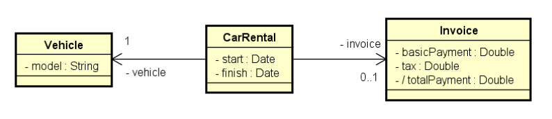
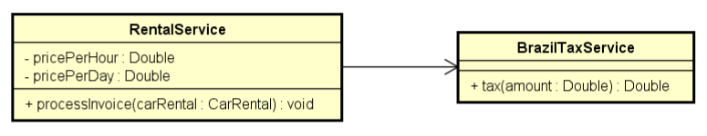
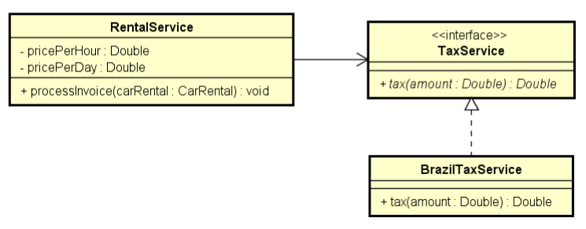

<!-- LOGO DIREITO -->
<a href="#"></a>

# Interfaces

<p align="left">
  <a href="https://github.com/JonathanTSilva/HL-Java">
    
  </a>
</p>

🔎 Assunto intermediário, mas de grande importância para sua aplicação Java.

<!-- SUMÁRIO -->
- [Interfaces](#interfaces)
  - [1. Introdução](#1-introdução)
    - [1.1. Programa exemplo](#11-programa-exemplo)
  - [2. Inversão de controle (IoC) x Injeção de dependência (ID)](#2-inversão-de-controle-ioc-x-injeção-de-dependência-id)
  - [3. Herdar x Cumprir contrato](#3-herdar-x-cumprir-contrato)
  - [4. Herança múltipla e o problema do diamante](#4-herança-múltipla-e-o-problema-do-diamante)
  - [5. Interface `Comparable`](#5-interface-comparable)
  - [6. *Default methods* (*defender methods*)](#6-default-methods-defender-methods)

<!-- VOLTAR AO INÍCIO -->
<a href="#"></a>

## 1. Introdução

A interface é um recurso muito utilizado em Java, bem como na maioria das linguagens orientadas a objeto, para “obrigar” um determinado grupo de classes a ter métodos ou propriedades em comum para existir em um determinado contexto, contudo os métodos podem ser implementados em cada classe de uma maneira diferente. Pode-se dizer, a grosso modo, que uma interface é um contrato que quando assumido por uma classe deve ser implementado.

A partir do Java 8, interfaces podem ter "default methods" ou "defender methods". Isso possui implicações conceituais e práticas, que serão discutidas mais à frente neste capítulo. Primeiro vamos trabalhar com a definição "clássica" de interfaces. Depois vamos acrescentar o conceito de default methods.

Em suma, interface é um tipo que define um conjunto de operações que uma classe deve implementar. A interface estabelece um contrato que a classe deve cumprir.

**Pra quê interfaces?**

Para criar sistemas com baixo acoplamento e flexíveis.

```java
interface Shape {
  double area();
  double perimeter();
}
```

### 1.1. Programa exemplo

Uma locadora brasileira de carros cobra um valor por hora para locações de até
12 horas. Porém, se a duração da locação ultrapassar 12 horas, a locação será
cobrada com base em um valor diário. Além do valor da locação, é acrescido no
preço o valor do imposto conforme regras do país que, no caso do Brasil, é 20%
para valores até 100.00, ou 15% para valores acima de 100.00. Fazer um
programa que lê os dados da locação (modelo do carro, instante inicial e final da
locação), bem como o valor por hora e o valor diário de locação. O programa
deve então gerar a nota de pagamento (contendo valor da locação, valor do
imposto e valor total do pagamento) e informar os dados na tela. Veja os
exemplos.

<details close="close" align="left">
  <summary><b>Exemplo 1</b></summary>
  <pre>
    <code>
Enter rental data
Car model: Civic
Pickup (dd/MM/yyyy hh:mm): 25/06/2018 10:30
Return (dd/MM/yyyy hh:mm): 25/06/2018 14:40
Enter price per hour: 10.00
Enter price per day: 130.00
INVOICE:
Basic payment: 50.00
Tax: 10.00
Total payment: 60.00
    </code>
  </pre>
</details>

<details close="close" align="left">
  <summary><b>Cálculos do exemplo 1</b></summary>
  <pre>
    <code>
Duration = (25/06/2018 14:40) - (25/06/2018 10:30) = 4:10 = 5 hours
Basic payment = 5 * 10 = 50
Tax = 50 * 20% = 50 * 0,2 = 10
    </code>
  </pre>
</details>


<details close="close" align="left">
  <summary><b>Exemplo 2</b></summary>
  <pre>
    <code>
Enter rental data
Car model: Civic
Pickup (dd/MM/yyyy hh:mm): 25/06/2018 10:30
Return (dd/MM/yyyy hh:mm): 27/06/2018 11:40
Enter price per hour: 10.00
Enter price per day: 130.00
INVOICE:
Basic payment: 390.00
Tax: 58.50
Total payment: 448.50
    </code>
  </pre>
</details>

<details close="close" align="left">
  <summary><b>Cálculos do exemplo 2</b></summary>
  <pre>
    <code>
Duration = (27/06/2018 11:40) - (25/06/2018 10:30) = 2 days + 1:10 = 3 days
Basic payment = 3 * 130 = 390
Tax = 390 * 15% = 390 * 0.15 = 58.50
    </code>
  </pre>
</details>

<details close="close" align="left">
  <summary><b>Diagrama UML - Design da camada de domínio</b></summary>
  <p float="left">
    
  </p>
</details>

<details close="close" align="left">
  <summary><b>Diagrama UML - Design da camada de serviço (sem interface)</b></summary>
  <p float="left">
    
  </p>
</details>

<details close="close" align="left">
  <summary><b>Diagrama UML - Design da camada de serviço (com interface)</b></summary>
  <p float="left">
    
  </p>
</details>

Os códigos de resolução para essa atividade podem ser encontrados na subpasta do projeto `Build/Course-JCPOO/ExRes15-Interface`.

Quando fazemos uma associação direta de uma classe para outra, é gerado um acoplamento forte entre elas. No exemplo acima, se realizado sem interface, a classe RentalService conhece a dependência concreta, ou seja, se esta classe concreta mudar, é preciso alterar também a classe RentalService (o que é indesejável).

Ao utilizar interface, a classe RentalService depende exclusivamente da interface TaxService, que por sua vez interfaceia qualquer outra classe concreta (BrazilTaxService, UsaTaxService, entre outras). Este acoplamento é fraco, sendo que a RentalService não conhece a concreta e se esta mudar, não é precisa alteração na RentalService.

<!-- VOLTAR AO INÍCIO -->
<a href="#"></a>

## 2. Inversão de controle (IoC) x Injeção de dependência (ID)

Injeção de Dependência é um padrão de projeto usado para evitar o alto nível de acoplamento de código dentro de uma aplicação. Sistemas com baixo acoplamento de código são melhores pelos seguintes motivos:

- aumento na facilidade de manutenção/implementação de novas funcionalidades
- habilita a utilização de mocks para realizar unit testes.

Pode ser implementada de várias formas:

- Construtor
- Classe de instanciação (builder/factory)
- Container/framework

Abaixo, um exemplo utilizado no exercício anterior de injeção de dependência por meio de construtor:

```java
class Program {
  static void Main(string[] args) {
    (...)
    RentalService rentalService = new RentalService(pricePerHours, pricePerDay, new BrazilTaxService());
  }
}
```

Está acontecendo um *upcasting* entre a instância `new BrazilTaxService()`para o construtor `TaxService taxService`.

```java
class RentalService {
  private TaxService taxService;

  public RentalService(Double pricePerDay, Double pricePerHour, TaxService taxService) {
    super();
    this.pricePerDay = pricePerDay;
    this.pricePerHour = pricePerHour;
    this.taxService = taxService;
  }
}
```

Injeção de dependência é uma das duas maneiras de implementar a inversão de controle. **Inversão de controle** é um termo mais amplo que consiste em retirar da classe a responsabilidade de instanciar suas dependências. A segunda maneira de implementar a IoC seria com *Service Locator*. Toda implementação de inversão de controle nos ajuda a seguir o primeiro e o último dos cinco princípios SOLID.

- S — Single-responsiblity principle
- O — Open-closed principle
- L — Liskov substitution principle
- I — Interface segregation principle
- D — Dependency Inversion Principle

O padrão **injeção de dependência** diz que módulos de alto nível não devem depender de módulos de baixo nível. Ambos devem depender de abstrações.
Abstrações não devem depender de detalhes. Detalhes devem depender de abstrações.

<!-- VOLTAR AO INÍCIO -->
<a href="#"></a>

## 3. Herdar x Cumprir contrato

Alguns aspectos em comum entre herança e interfaces:

- Relação é-um
- Generalização/especialização
- Polimorfismo

![herancaXinterface][A]

Entretanto, algumas diferenças fundamentais:

- Herança $\to$ reuso
- Interface $\to$ contrato a ser cumprido

E se precisar implementar `Shape` como interface, porém também quiser definir uma estrutura comum reutilizável para todas figuras?

![interfaces04][B]

Por que é interessante colocar o contrato como interface? Pois dessa nova forma, pode-se ter classes concretas que não possuem cor, mas que são figuras, diferentemente da forma antiga (figura esquerda), que diz que todas as figuras, devem ter cor.

Outro exemplo:

![interfaces05][C]

<!-- VOLTAR AO INÍCIO -->
<a href="#"></a>

## 4. Herança múltipla e o problema do diamante

A herança múltipla pode gerar o problema do diamante: uma ambiguidade causada pela existência do mesmo método em mais de uma superclasse.

Herança múltipla não é permitida na maioria das linguagens!

Abaixo, exemplo de um problema do diamante:

![herancaMulti][D]

**Porém, uma classe pode implementar mais de uma interface**

**Atenção**: isso NÃO é herança múltipla, pois NÃO HÁ REUSO na relação entre `ComboDevice` e as interfaces `Scanner` e `Printer`. `ComboDevide` não herda, mas sim implementa as interfaces (cumpre o contrato).

![interfaces06][E]

Para verificar a prática desta implementação, acesse o projeto [interfaces3][1] do acenelio.

<!-- VOLTAR AO INÍCIO -->
<a href="#"></a>

## 5. Interface `Comparable`

A documentação desta interface pode ser verificada neste [link][2].

```java
public interface Comparable<T> {
  int compareTo(T o);
}
```

Para entender esta interface, resolver o problema motivado:

Faça um programa para ler um arquivo contendo nomes de pessoas (um nome por linha), armazenando-os em uma lista. Depois, ordenar os dados dessa lista e mostrá-los ordenadamente na tela. Nota: o caminho do arquivo pode ser informado "hardcode".

```plaintext
Maria Brown
Alex Green
Bob Grey
Anna White
Alex Black
Eduardo Rose
Willian Red
Marta Blue
Alex Brown
```

```java
package application;

import java.io.BufferedReader;
import java.io.FileReader;
import java.io.IOException;
import java.util.ArrayList;
import java.util.Collections;
import java.util.List;

public class Program {
    
  public static void main(String[] args) {
      
    List<String> list = new ArrayList<>();
    String path = "C:\\temp\\in.txt";
    try (BufferedReader br = new BufferedReader(new FileReader(path))) {
      String name = br.readLine();
      while (name != null) {
        list.add(name);
        name = br.readLine();
      }
        Collections.sort(list);
        for (String s : list) {
          System.out.println(s);
        }
    } catch (IOException e) {
      System.out.println("Error: " + e.getMessage());
    }
      
  }
}
```

Outro problema:

Faça um programa para ler um arquivo contendo funcionários (nome e salário) no formato .csv, armazenando-os em uma lista. Depois, ordenar a lista por nome e mostrar o resultado na tela. Nota: o caminho do arquivo pode ser informado "hardcode".

```plaintext
Maria Brown,4300.00
Alex Green,3100.00
Bob Grey,3100.00
Anna White,3500.00
Alex Black,2450.00
Eduardo Rose,4390.00
Willian Red,2900.00
Marta Blue,6100.00
Alex Brown,5000.00
```

```java
package application;

import java.io.BufferedReader;
import java.io.FileReader;
import java.io.IOException;
import java.util.ArrayList;
import java.util.Collections;
import java.util.List;
import entities.Employee;

public class Program {
    
  public static void main(String[] args) {
      
    List<Employee> list = new ArrayList<>();
    String path = "C:\\temp\\in.txt";
    try (BufferedReader br = new BufferedReader(new FileReader(path))) {
      String employeeCsv = br.readLine();
      while (employeeCsv != null) {
        String[] fields = employeeCsv.split(",");
        list.add(new Employee(fields[0], Double.parseDouble(fields[1])));
        employeeCsv = br.readLine();
      }
      Collections.sort(list);
      for (Employee emp : list) {
        System.out.println(emp.getName() + ", " + emp.getSalary());
      }
    } catch (IOException e) {
      System.out.println("Error: " + e.getMessage());
    }

  }

}
```

```java
package entities;

public class Employee implements Comparable<Employee> {
  private String name;
  private Double salary;

  public Employee(String name, Double salary) {
    this.name = name;
    this.salary = salary;
  }

  public String getName() {
    return name;
  }

  public void setName(String name) {
    this.name = name;
  }

  public Double getSalary() {
    return salary;
  }

  public void setSalary(Double salary) {
    this.salary = salary;
  }

  // Esse método serve para comparar um objeto com outro
  // Retorna um inteiro negativo, zero ou inteiro positivo conforme 
  // o objeto for menor que, igual a ou maior que o objeto especificado
  @Override
  public int compareTo(Employee other) {
    return name.compareTo(other.getName());
  }
}
```

<!-- VOLTAR AO INÍCIO -->
<a href="#"></a>

## 6. *Default methods* (*defender methods*)

A partir do Java 8, interfaces podem conter métodos concretos.

A intenção básica é prover implementação padrão para métodos, de modo a evitar:

1. repetição de implementação em toda classe que implemente a interface
2. a necessidade de se criar classes abstratas para prover reuso da implementação

Outras vantagens:

- Manter a retrocompatibilidade com sistemas existentes
- Permitir que "interfaces funcionais" (que devem conter apenas um método) possam prover outras operações padrão reutilizáveis

**Problema exemplo:**

Fazer um programa para ler uma quantia e a duração em meses de um empréstimo. Informar o valor a ser pago depois de decorrido o prazo do empréstimo, conforme regras de juros do Brasil. A regra de cálculo de juros do Brasil é juro composto padrão de 2% ao mês. Veja o exemplo.

```plaintext
Amount: 200.00
Months: 3
Payment after 3 months:
212.24
```

Para verificar a resolução deste problema, acessar projeto [interfaces5][3] do acenelio.

**Considerações importantes**

- Sim: agora as interfaces podem prover reuso
- Sim: agora temos uma forma de herança múltipla
- Mas o compilador reclama se houver mais de um método com a mesma assinatura, obrigando a sobrescreve-lo
- Interfaces ainda são bem diferentes de classes abstratas. Interfaces não possuem recursos tais como construtores e atributos.

<!-- MARKDOWN LINKS -->
<!-- SITES -->
[1]: https://github.com/acenelio/interfaces3-java/tree/master/src/devices
[2]: https://docs.oracle.com/javase/10/docs/api/java/lang/Comparable.html
[3]: https://github.com/acenelio/interfaces5-java

<!-- IMAGES -->
[A]: ../../Images/herancaXinterface.png
[B]: ../../Images/interfaces04.png
[C]: ../../Images/interfaces05.png
[D]: ../../Images/herancaMulti.png
[E]: ../../Images/interfaces06.png