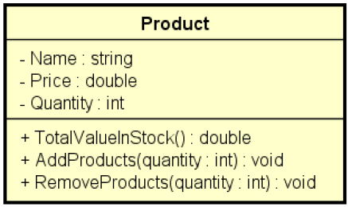

<!-- LOGO DIREITO -->
<a href="#"></a>

# Introdução à Programação Orientada a Objetos

<p align="left">
  <a href="https://github.com/JonathanTSilva/HL-Java">
    
  </a>
</p>

🏛 Uma introdução à Programação Orientada a Objetos (POO).

<!-- SUMÁRIO -->

<!-- VOLTAR AO INÍCIO -->
<a href="#"></a>

## 1. O que é a POO?

Antes de definir o que é Programação Orientada a Objetos, é preciso pontuar algumas questões de outro paradigma de programação: a programação estruturada. Neste tipo de programa, é possível observar três tipos básicos de estruturas:

- sequências: são os comandos a serem executados;
- condições: sequências que só devem ser executadas se uma condição for satisfeita (exemplos: `if-else`, `switch` e comandos parecidos);
- repetições: sequências que devem ser executadas repetidamente até uma condição for satisfeita (`for`, `while`, `do-while` etc).

A diferença principal é que na programação estruturada, um programa é tipicamente escrito em uma única rotina (ou função) podendo, é claro, ser quebrado em subrotinas, mas ainda mantendo o fluxo do programa. Além disso, o acesso às variáveis não possuem muitas restrições em linguagens fortemente baseadas neste paradigma, visto que restringir o acesso à uma variável se limita a dizer se ela é visível ou não dentro de uma função (ou módulo, como no uso da palavra-chave static, na linguagem C), mas não se consegue dizer de forma nativa que uma variável pode ser acessada por apenas algumas rotinas do programa.

A **programação orientada a objetos** surgiu como uma alternativa a essas características da programação estruturada. O intuito da sua criação também foi o de aproximar o manuseio das estruturas de um programa ao manuseio das coisas do mundo real, daí o nome "objeto" como uma algo genérico, que pode representar qualquer coisa tangível.

Esse novo paradigma se baseia principalmente em dois conceitos chave: **classes** e **objetos**. Todos os outros conceitos, igualmente importantes, são construídos em cima desses dois.

<!-- VOLTAR AO INÍCIO -->
<a href="#"></a>

## 2. Recursos da POO

### 2.1. Classe

- Classe é um tipo estruturado que pode conter (membros):
  - Atributos (dados/campos);
  - Métodos (funções/operações).
- A classe também pode prover outros recursos, tais como:
  - Construtores;
  - Sobrecarga;
  - Encapsulamento;
  - Herança;
  - Polimorfismo.
- Exemplos:
  - Entidades: Produto, Cliente, Triangulo;
  - Serviços: ProdutoService, ClienteService, EmailService, StorageService;
  - Controladores: ProdutoController, ClienteController;
  - Utilitários: Calculadora, Compactador;
  - Outros (views, repositórios, gerenciadores, etc.)

Toda a classe em Java é uma subclasse da classe `Object`; que por sua vez, possui os seguintes métodos:

- `getClass` - retorna o tipo de objeto;
- `equal` - compara se o objeto é igual a outro;
- `hashCode` - retorna um código hash do objeto;
- `toString` - converto o objeto para string.

### 2.2. Instanciação

A instanciação é um processo por meio do qual se realiza a cópia de um objeto (classe) existente. Uma classe, a qual tem a função de determinar um tipo de dado, deve ser instanciada para que possamos utilizá-la.

![instanciacao][B]

## 3. Exemplos práticos

### 3.1. Área triângulo

Abaixo, será resolvido o mesmo exercício de exemplo adicionando gradualmente as características da Programação Orientada a Objetos.

O problema consiste em:

Fazer um programa para ler as medidas dos lados de dois triângulos X e Y (suponha medidas válidas). Em seguida, mostrar o valor das áreas dos dois triângulos e dizer qual dos dois triângulos possui a maior área.

A fórmula para calcular a área de um triângulo a partir das medidas de seus lados **a**, **b** e **c** é a seguinte (fórmula de Heron):

![equation][A]

**Exemplo:**

> Enter the measures of triangle X:
> 3.00
> 4.00
> 5.00
> Enter the measures of triangle Y:
> 7.50
> 4.50
> 4.02
> Triangle X area: 6.0000
> Triangle Y area: 7.5638
> Larger area: Y

#### 3.1.1. Sem POO

```java
package application;

import java.util.Locale;
import java.util.Scanner;

public class Program {
    public static void main(String[] args) {

        Locale.setDefault(Locale.US);
        Scanner sc = new Scanner(System.in);

        double xA, xB, xC, yA, yB, yC;

        System.out.println("Enter the measures of triangle X: ");
        xA = sc.nextDouble();
        xB = sc.nextDouble();
        xC = sc.nextDouble();
        System.out.println("Enter the measures of triangle Y: ");
        yA = sc.nextDouble();
        yB = sc.nextDouble();
        yC = sc.nextDouble();

        double p = (xA + xB + xC) / 2.0;
        double areaX = Math.sqrt(p * (p - xA) * (p - xB) * (p - xC));

        p = (yA + yB + yC) / 2.0;
        double areaY = Math.sqrt(p * (p - yA) * (p - yB) * (p - yC));

        System.out.printf("Triangle X area: %.4f%n", areaX);
        System.out.printf("Triangle Y area: %.4f%n", areaY);

        if (areaX > areaY) {
            System.out.println("Larger area: X");
        }
        else {
            System.out.println("Larger area: Y");
        }

        sc.close();
    }
}
```

#### 3.1.2. Com classe

- Triângulo é uma entidade com três atributos: a, b, c;
- Estamos utilizando três variáveis distintas para representar cada triângulo:
  - `double aX, bX, cX, aY, bY, cY`;
- Para melhorar isso, vamos utilizar uma CLASSE para representar o triângulo.

```java
package entities;

public class Triangle {
    public double a;
    public double b;
    public double c;
}
```

```java
package application;

import java.util.Locale;
import java.util.Scanner;

import entities.Triangle;

public class Program {
    [...]
    Triangle x, y;
    x = new Triangle();
    y = new Triangle();

    System.out.println("Enter the measures of triangle X: ");
    x.a = sc.nextDouble();
    x.b = sc.nextDouble();
    x.c = sc.nextDouble();
    System.out.println("Enter the measures of triangle Y: ");
    y.a = sc.nextDouble();
    y.b = sc.nextDouble();
    y.c = sc.nextDouble();

    double p = (x.a + x.b + x.c) / 2.0;
    double areaX = Math.sqrt(p * (p - x.a) * (p - x.b) * (p - x.c));

    p = (y.a + y.b + y.c) / 2.0;
    double areaY = Math.sqrt(p * (p - y.a) * (p - y.b) * (p - y.c));
    [...]
```

> **Nota:** é necessário importar na aplicação principal toda classe que será instanciada. Neste caso, `import entities.Triangle;`.

#### 3.1.3. Com método

Com o uso de classe, agora nós temos uma variável composta do tipo "Triangle" para representar cada triângulo:

```java
Triangle x, y;
x = new Triangle();
y = new Triangle();
```

Agora vamos melhorar nossa classe, acrescentando nela um MÉTODO para calcular a área.

No projeto de entidades:

```java
package entities;

public class Triangle {
    public double a;
    public double b;
    public double c;

    public double area() {
        double p = (a + b + c) / 2.0;
        return Math.sqrt(p * (p - a) * (p - b) * (p - c));
    }
}
```

No projeto principal:

```java
package application;

import java.util.Locale;
import java.util.Scanner;

import entities.Triangle;

public class Program {
    [...]
    double areaX = x.area();
    double areaY = y.area();
    [...]
```

![estrutura][C]

**Quais são os benefícios de utilizar um método dentro da classe?**

1. Reaproveitamento de código: elimina-se o código repetido no programa principal;
2. Delegação de responsabilidades.

### 3.2. Produto no estoque

Fazer um programa para ler os dados de um produto em estoque (nome, preço e quantidade no estoque). Em seguida:

- Mostrar os dados do produto (nome, preço, quantidade no estoque, valor total no
estoque);
- Realizar uma entrada no estoque e mostrar novamente os dados do produto;
- Realizar uma saída no estoque e mostrar novamente os dados do produto.

Para resolver este problema, você deve criar uma CLASSE conforme projeto UML abaixo:



**Estrutura do projeto**

```plaintext
|- Java Project
||- JRE System Library
||- src
|||- application
||||- Program.java
|||- entities
||||- Product.java
```

**Program.java**

```java
package application;

import java.util.Locale;
import java.util.Scanner;

import entities.Product;

public class Program {
 public static void main(String[] args) {
  
  Locale.setDefault(Locale.US);
  Scanner sc = new Scanner(System.in);
  
  Product product = new Product();
  
  System.out.println("Enter product data:");
  System.out.println("Name:");
  product.name = sc.nextLine();
  System.out.println("Price:");
  product.price = sc.nextDouble();
  System.out.println("Quantity in stock:");
  product.quantity = sc.nextInt();
  
  System.out.println();
  System.out.println("Product data: " + product);
  
  System.out.println();
  System.out.println("Enter the number of products to be added in stock: ");
  int quantity = sc.nextInt();
  product.addProducts(quantity);
  
  System.out.println();
  System.out.println("Updated data: " + product);
  
  System.out.println();
  System.out.println("Enter the number of products to be removed from stock: ");
  quantity = sc.nextInt();
  product.removeProducts(quantity);
  
  System.out.println();
  System.out.println("Updated data: " + product);
  
  sc.close();
 }
}
```

**Product.java**

```java
package entities;

public class Product {
 public String name;
 public double price;
 public int quantity;
 
 public double totalValueInStock() {
  return price * quantity;
 }
 
 public void addProducts( int quantity ) {
  this.quantity += quantity;
 }
 
 public void removeProducts( int quantity ) {
  this.quantity -= quantity;
 }
 
 // Sobrepõe o método toString padrão do Object
 public String toString() {
  return name
   + ", $ "
   + String.format("%.2f", price) // Para deixar formatado como no printf
   + ", "
   + quantity
   + " units, Total: $ "
   + String.format("%.2f", totalValueInStock());
 }
}
```

## 4. Diagrama UML

<!-- MARKDOWN LINKS -->
<!-- SITES -->

<!-- IMAGES -->
[A]: https://latex.codecogs.com/svg.image?area&space;=&space;\sqrt{p(p-a)(p-b)(p-c)},&space;\text{&space;onde:&space;}&space;p&space;=&space;\frac{a&plus;b&plus;c}{2}
[B]: ../../Images/instaciacao.png
[C]: ../../Images/estrutura.png
