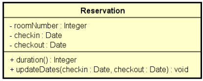

<!-- LOGO DIREITO -->
<a href="#"></a>

# Tratamento de exceções

<p align="left">
  <a href="https://github.com/JonathanTSilva/HL-Java">
    
  </a>
</p>

🔕 Uma abordagem prática para entender o tratamento de exceções no Java.

<!-- SUMÁRIO -->
- [Tratamento de exceções](#tratamento-de-exceções)
  - [1. Introdução](#1-introdução)
    - [1.1. Hierarquia de exceções do Java](#11-hierarquia-de-exceções-do-java)
  - [2. Estrutura try-catch](#2-estrutura-try-catch)
  - [3. Pilha de chamadas de métodos](#3-pilha-de-chamadas-de-métodos)
  - [4. Bloco `finally`](#4-bloco-finally)
  - [5. Criando exceções personalizadas](#5-criando-exceções-personalizadas)
    - [Solução 1](#solução-1)

<!-- VOLTAR AO INÍCIO -->
<a href="#"></a>

## 1. Introdução

Para projetar uma boa solução de programação, é necessário conhecer qual a solução ruim para contornar tais problemas, começando com uma solução muito ruim, posteriormente, apresentando melhorias, e por fim, chegando à melhor solução, na qual foram tratadas todas as exceções anteriormente encontradas.

Uma exceção é qualquer condição de erro ou comportamento inesperado encontrado por um programa em execução. Em Java, uma exceção é um objeto herdado da classe:

- `java.lang.Exception` - o compilador obriga a tratar ou propagar;
- `java.lang.RuntimeException` - o compilador não obriga a tratar ou propagar.

Quando lançada, uma exceção é propagada na pilha de chamadas de métodos em execução, até que seja capturada (tratada) ou o programa seja encerrado.

O tratamento de exceções permite gerenciar os erros durante a execução de uma forma organizada. Assim, pode-se invocar uma rotina de tratamento de erro quando um erro ocorrer, pois fornece um meio de transferir o controle e as informações de um ponto na execução de um programa para um "tratador de exceções" associado a um ponto previamente passado pela execução.

Um tratamento de exceções pode ser usado para suportar noções de tratamento de erros e computação tolerante a falhas.

O mecanismo de tratamento de exceções requer o uso de três palavras chave: `try`, `catch` e `throw`. Nos termos mais gerais, os comandos de programa que devem ser monitorados para as exceções estão contidos em um bloco de prova (try). Se uma exceção (ou erro) ocorrer dentro do bloco de prova, será disparada usando throw. A exceção é pega, usando catch, e processada.

Em suma, qualquer comando que dispara uma exceção precisa ter sido executado dentro de um bloco try. Qualquer exceção precisa ser pega por um comando catch que segue imediatamente o comando try que dispara a exceção, isto é, se uma exceção é chamada no bloco try, o controle do programa é transferido para o gerenciador de exceção apropriado. É importante citar que as funções chamadas a partir de dentro de um bloco try também podem disparar uma exceção, e que o comando catch irá gerenciar qualquer exceção, independente do tipo

O modelo de tratamento de exceções permite que erros sejam tratados de forma consistente e flexível, usando boas práticas. Esse modelo apresenta as seguintes vantagens:

- Delega a lógica do erro para a classe responsável por conhecer as regras que podem ocasionar o erro;
- Trata de forma organizada (inclusive hierárquica) exceções de tipos diferentes;
- A exceção pode carregar dados quaisquer.

### 1.1. Hierarquia de exceções do Java

Segue abaixo, uma amostra da hierarquia de exceções do Java. Para maiores informações, visite a página da qual ela foi extraída: [Hierarchy For Package java.lang][1], da Oracle.

![hie][A]

Tem-se uma superclass `Throwable` (classe genérica de todas as exceções e erros) e subclasses: `Error` (agrupa todos os erros que não espera-se tratamento pelo programador) e `Exception`, cujo o programa tem a possibilidade do programa tratar (sendo que na `RuntimeException`, o compilador não obriga a tratar os erros)

<!-- VOLTAR AO INÍCIO -->
<a href="#"></a>

## 2. Estrutura try-catch

Como visto na introdução deste artigo, para tratar as exceções em Java são utilizados os comandos `try` e `catch`. Esses comandos apresentam a sintaxe abaixo:

```java
try {
 // Bloco de prova - inclui qualquer código que pode chamar uma exceção (throw)
} catch (ExceptionType arg) {
 // Executa algumas ações
} catch (ExceptionType arg) {
 // Executa algumas ações
} catch (ExceptionType arg) {
 // Executa algumas ações
}
```

O bloco `try` contém o código que representa a execução normal do trecho de código que pode acarretar em uma exceção. Complementarmente, o bloco `catch` contém o código a ser executado caso uma exceção ocorra. Deve ser especificado o tipo de exceção a ser tratada (aqui, o *upcasting* é permitido).

**Exemplo:**

```java
Scanner sc = new Scanner(System.in);

try {
  String[] vect = sc.nextLine().split(" ");
  int position = sc.nextInt(); // Uma das exceções é digitar uma letra ao invés de um número
  // ou, digitar uma posição que não está dentro do limite do vetor
  System.out.println(vect[position]);
}
catch (ArrayIndexOutOfBoundsException e) {
  System.out.println("Invalid position");
}
catch (InputMismatchException e) {
  System.out.println("Input error");
}

System.out.println("End of program");

sc.close();
```

<!-- VOLTAR AO INÍCIO -->
<a href="#"></a>

## 3. Pilha de chamadas de métodos

A pilha de chamadas (call stack) é um mecanismo do interpretador de uma linguagem que organiza o funcionamento do script quando são chamadas muitas funções, qual função está sendo executada no momento, e quais serão chamadas dentro de alguma função, etc.

- Quando o script chama a função, ela é adicionada à pilha de chamadas, e então é iniciado o carregamento da função.
- Qualquer função chamada por essa função será adicionada à pilha de chamadas uma acima da outra.
- Quando a função termina a execução, o interpretador retira a função da pilha e continua a execução do programa de onde parou.
- Caso a pilha ocupar mais espaço do que foi separado a ela, será exibido um erro "stack overflow" (estouro de pilha).

**Exemplo:**

```java
public class Program {
  public static void main(String[] args) {
    method1();
    System.out.println("End of program");
  }
  
  public static void method1() {
    System.out.println("*** METHOD1 START ***");
    method2();
    System.out.println("*** METHOD1 END ***");
  }

  public static void method2() {
    System.out.println("*** METHOD2 START ***");
    Scanner sc = new Scanner(System.in);
    try {
        String[] vect = sc.nextLine().split(" ");
        int position = sc.nextInt(); // Uma das exceções é digitar uma letra ao invés de um número
        // ou, digitar uma posição que não está dentro do limite do vetor
        System.out.println(vect[position]);
    }
    catch (ArrayIndexOutOfBoundsException e) {
        System.out.println("Invalid position");
        e.printStackTrace(); // Imprime o tipo da exceção, mensagem e a sequencia de chamadas que gerou a exeção
        sc.next();
    }
    catch (InputMismatchException e) {
        System.out.println("Input error");
        e.printStackTrace();
    }
    sc.close();
    System.out.println("*** METHOD2 END ***");
  }  
}
```

<!-- VOLTAR AO INÍCIO -->
<a href="#"></a>

## 4. Bloco `finally`

É um bloco que contém código a ser executado independentemente de ter ocorrido ou não uma exceção.

Um exemplo clássico para ilustrar a aplicação deste bloco é: fechar um arquivo, conexão com o banco de dados, ou outro recurso específico ao final do processamento.

```java
try{

} catch(ExceptionType e) {

} finally {

}
```

**Exemplo:**

```java
package application;

import java.io.File;
import java.io.IOException;
import java.util.Scanner;

public class Program1 {
  public static void main(String[] args) {
    File file = new File("C:\\temp\\in.txt");
    Scanner sc = null;
    try {
      sc = new Scanner(file);
      while (sc.hasNextLine()) {
        System.out.println(sc.nextLine());
      }
    } catch (IOException e) {
      System.out.println("Error opening file: " + e.getMessage());
    } finally { // É executado independentemente do sucesso ou não do try
      if (sc != null) {
        sc.close();
      }
    }
  }
}
```

<!-- VOLTAR AO INÍCIO -->
<a href="#"></a>

## 5. Criando exceções personalizadas

Quando vamos fazer uma aplicação, ela terá a interface com o usuário, responsável pelas telas e seus controladores, e também o model, que é o sistema em si.

O model representa os dados do sistema e as transformações desses dados conforme as regras de negócio.

Uma sugestão de pacotes model é dada abaixo:

![model][B]

**Exercício resolvido:** ler os dados de uma reserva de hotel (número do quarto, data de entrada e data de saída) e mostrar os dados da reserva, inclusive sua duração em dias. Em seguida, ler novas datas de entrada e saída, atualizar a reserva, e mostrar novamente a reserva com os dados atualizados. O programa não deve aceitar dados inválidos para a reserva, conforme as seguintes regras:

- Alterações de reserva só podem ocorrer para datas futuras
- A data de saída deve ser maior que a data de entrada

<details close="close" align="left">
  <summary><b>Diagrama UML</b></summary>
  <p float="left">
    
  </p>
</details>

<details close="close" align="left">
  <summary><b>Exemplo 1</b></summary>
  <pre>
    <code>
Room number: 8021
Check-in date (dd/MM/yyyy): 23/09/2019
Check-out date (dd/MM/yyyy): 26/09/2019
Reservation: Room 8021, check-in: 23/09/2019, check-out: 26/09/2019, 3 nights
Enter data to update the reservation:
Check-in date (dd/MM/yyyy): 24/09/2019
Check-out date (dd/MM/yyyy): 29/09/2019
Reservation: Room 8021, check-in: 24/09/2019, check-out: 29/09/2019, 5 nights
<br>
Room number: 8021
Check-in date (dd/MM/yyyy): 23/09/2019
Check-out date (dd/MM/yyyy): 21/09/2019
Error in reservation: Check-out date must be after check-in date
    </code>
  </pre>
</details>

<details close="close" align="left">
  <summary><b>Exemplo 2</b></summary>
  <pre>
    <code>
Room number: 8021
Check-in date (dd/MM/yyyy): 23/09/2019
Check-out date (dd/MM/yyyy): 26/09/2019
Reservation: Room 8021, check-in: 23/09/2019, check-out: 26/09/2019, 3 nights
Enter data to update the reservation:
Check-in date (dd/MM/yyyy): 24/09/2015
Check-out date (dd/MM/yyyy): 29/09/2015
Error in reservation: Reservation dates for update must be future dates
<br>
Room number: 8021
Check-in date (dd/MM/yyyy): 23/09/2019
Check-out date (dd/MM/yyyy): 26/09/2019
Reservation: Room 8021, check-in: 23/09/2019, check-out: 26/09/2019, 3 nights
Enter data to update the reservation:
Check-in date (dd/MM/yyyy): 24/09/2020
Check-out date (dd/MM/yyyy): 22/09/2020
Error in reservation: Check-out date must be after check-in date
    </code>
  </pre>
</details>

Para facilitar o entendimento da aplicação de um tratamento de exceções adequado, a solução será dividida em três partes:

1. Solução muito ruim: lógica de validação no programa principal
2. Solução ruim: método retornando string
3. Solução boa: tratamento de exceções

Para qualquer uma das soluções, a classe `Reservation` será a mesma:

```java
package model.entities;

import java.sql.Date;
import java.text.SimpleDateFormat;
import java.util.concurrent.TimeUnit;

public class Reservation {

  private Integer roomNumber;
  private Date checkIn;
  private Date checkOut;
  
  // O estático é utilizado para que não seja instanciado um sdf para cada aplicação Reservation
  private static SimpleDateFormat sdf = new SimpleDateFormat("dd/MM/yyyy");
  
  public Reservation(Integer roomNumber, Date checkIn, Date checkOut) {
    this.roomNumber = roomNumber;
    this.checkIn = checkIn;
    this.checkOut = checkOut;
  }

  public Integer getRoomNumber() {
    return roomNumber;
  }

  public void setRoomNumber(Integer roomNumber) {
    this.roomNumber = roomNumber;
  }

  public Date getCheckIn() {
    return checkIn;
  }

  public Date getCheckOut() {
    return checkOut;
  }

  public long duration() {
    long diff = checkOut.getTime() - checkIn.getTime();
    return TimeUnit.DAYS.convert(diff, TimeUnit.MILLISECONDS);
  }
  
  public void updateDates(Date checkIn, Date checkOut) {
    this.checkIn = checkIn;
    this.checkOut = checkOut;
  }

  @Override
  public String toString() {
    return "Room "
      + roomNumber
      + ", checkIn: "
      + sdf.format(checkIn)
      + ", checkOut: "
      + sdf.format(checkOut)
      + ", "
      + duration()
      + " nights";
  }

}
```

### Solução 1

**src > application > Program.java**

```java
package application;

import java.text.ParseException;
import java.text.SimpleDateFormat;
import java.util.Date;
import java.util.Scanner;

import model.entities.Reservation;

public class Program {

  public static void main(String[] args) throws ParseException {

    Scanner sc = new Scanner(System.in);
    SimpleDateFormat sdf = new SimpleDateFormat("dd/MM/yyyy");

    System.out.print("Room number: ");
    int number = sc.nextInt();
    System.out.print("Check-in date (dd/MM/yyyy): ");
    Date checkIn = sdf.parse(sc.next());
    System.out.print("Check-out date (dd/MM/yyyy): ");
    Date checkOut = sdf.parse(sc.next());

    if (!checkOut.after(checkIn)) {
      System.out.println("Error in reservation: Check-out date must be after check-in date");
    }
    else {
      Reservation reservation = new Reservation(number, checkIn, checkOut);
      System.out.println("Reservation: " + reservation);

      System.out.println();
      System.out.println("Enter data to update the reservation:");
      System.out.print("Check-in date (dd/MM/yyyy): ");
      checkIn = sdf.parse(sc.next());
      System.out.print("Check-out date (dd/MM/yyyy): ");
      checkOut = sdf.parse(sc.next());

      Date now = new Date();
      if (checkIn.before(now) || checkOut.before(now)) {
        System.out.println("Error in reservation: Reservation dates for update must be future dates");
      }
      else if (!checkOut.after(checkIn)) {
        System.out.println("Error in reservation: Check-out date must be after check-in date");
      }
      else {
        reservation.updateDates(checkIn, checkOut);
        System.out.println("Reservation: " + reservation);
      }
    }

    sc.close();
  }

}
```

<!-- MARKDOWN LINKS -->
<!-- SITES -->
[1]: https://docs.oracle.com/javase/8/docs/api/java/lang/package-tree.html

<!-- IMAGES -->
[A]: ../../Images/exceptionHie.png
[B]: ../../Images/model.png
